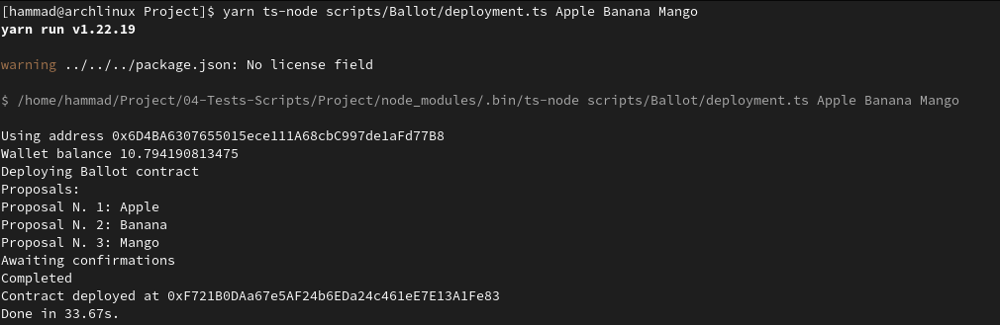
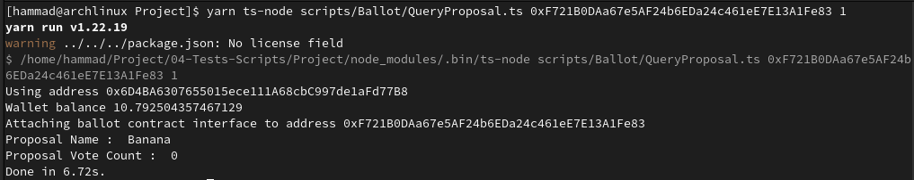
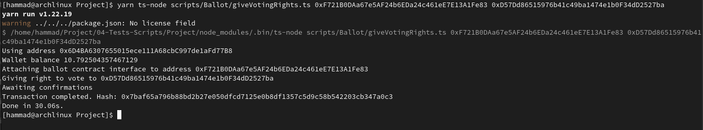
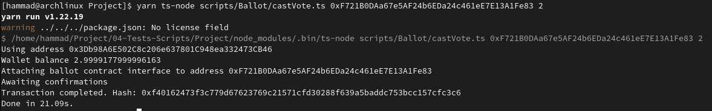
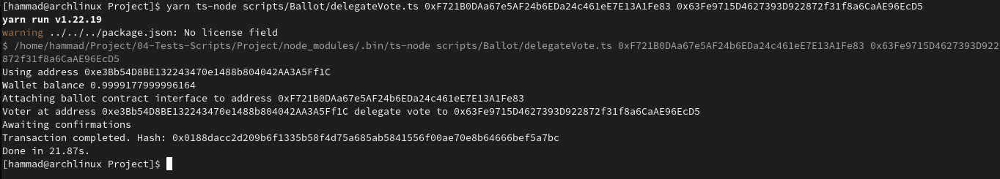
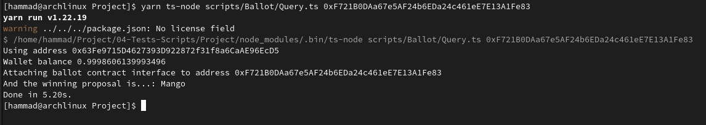
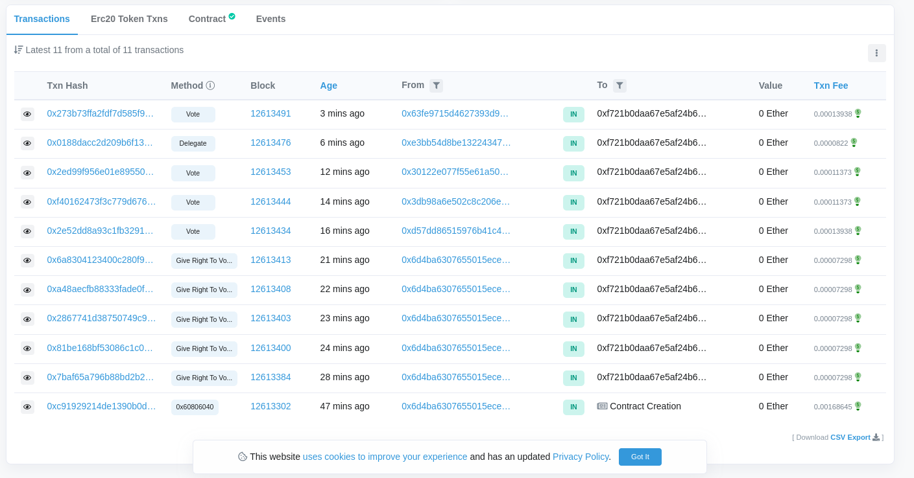

# Weekend Project
* Form groups of 3 to 5 students
* Structure scripts to
  * Deploy
  * Query proposals
  * Give vote right passing an address as input
  * Cast a vote to a ballot passing contract address and proposal as input and using the wallet in environment
  * Delegate my vote passing  user address as input and using the wallet in environment
  * Query voting result and print to console
* Publish the project in Github
* Run the scripts with a set of proposals, cast and delegate votes and inspect results
* Write a report detailing the addresses, transaction hashes, description of the operation script being executed and console output from script execution for each step (Deployment, giving voting rights, casting/delegating and querying results).
* (Extra) Use TDD methodology

# (Group#9 Members)
* Muhammad Hammad Mobin (@hammadmobin#3911)
* Ece Metin (@ece#1887)
* Udi İbgui (@udi#5722)
* Alfred Opon (@og1ste#6515)

|ChairPerson| Ballot | 
| :---: | :---: | 
| 0x6D4BA6307655015ece111A68cbC997de1aFd77B8 | 0xF721B0DAa67e5AF24b6EDa24c461eE7E13A1Fe83 |

| Proposals |
| --- | 
| Apple |
| Banana | 
| Mango |

| Voters | Address | 
| --- | --- | 
| 1 | 0xD57Dd86515976b41c49ba1474e1b0F34dD2527ba|
| 2 | 0x3Db98A6E502C8c206e637801C948ea332473CB46 |
| 3 | 0x30122e077f55E61a5073b348Db3207Ec66da309B |
| 4 | 0xe3Bb54D8BE132243470e1488b804042AA3A5Ff1C |
| 5 | 0x63Fe9715D4627393D922872f31f8a6CaAE96EcD5 (Delegate) |

# Scripts

## Deploy
First, we deployed the smart contract as a ballot to interact with it and assign chairperson.

## Query proposals
Here, we just make query that give us proposals vote count and name.

## Give vote right passing an address as input
After assigning of the chairperson , Chairpeson have access to the give the rights to vote to someone.

## Cast a vote to a ballot passing contract address and proposal as input and using the wallet in environment
In this scenario, voter give a vote to the proposal.

## Delegate my vote passing  user address as input and using the wallet in environment
Here, voter can delegate vote.

## Query voting result and print to console
Its shows us the winning proposal, who got most vote.

## EtherScan Transaction Explorer 

